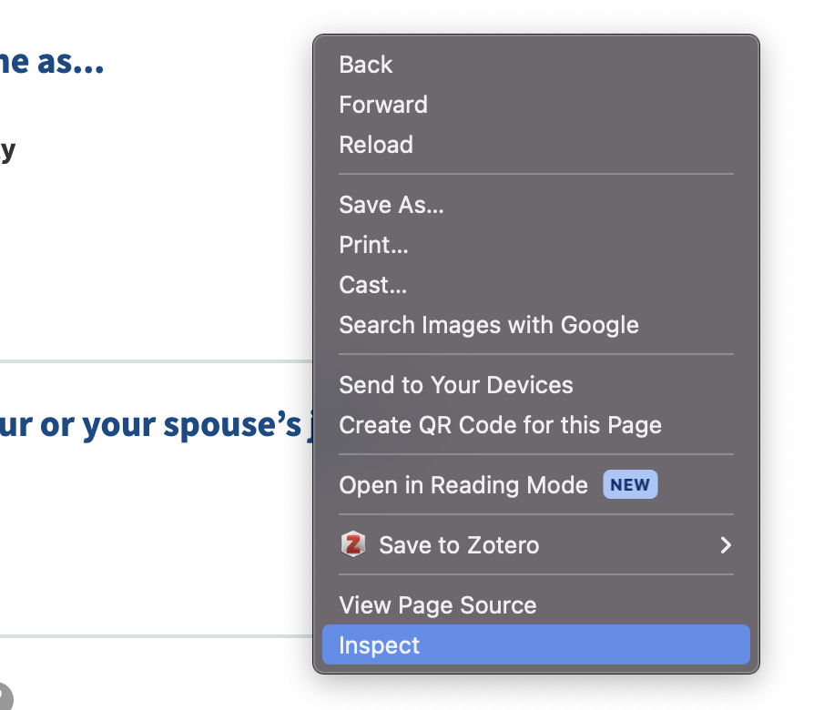
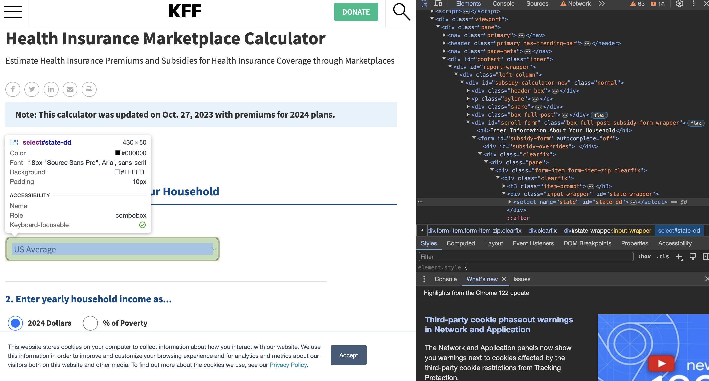
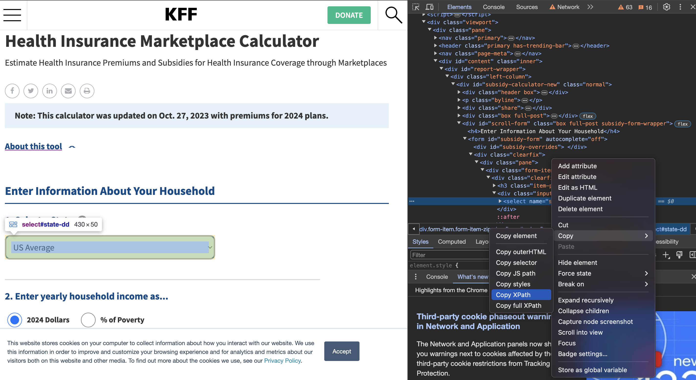

# Overview

Today we'll be digging into how to get started with a web scraping task and how to structure your thinking about approaching the task. For the remainder of the boot camp we'll be working on scraping state-level health insurance premium values from the KFF [Health Insurance Marketplace Calculator](https://www.kff.org/interactive/subsidy-calculator/). In this example, the project team needs the cost of the Sliver Plan Premium for each county for people aged 14, 20, 40, and 60. The final output should look something like this:

| State | County    | Age 14 | Age 20 | Age 40 | Age 60 |
|-------|-----------|--------|--------|--------|--------|
| AL    | St. Clair | 281    | 434    | 566    | 1824   |
| AL    | Jefferson | 294    | 420    | 540    | 1830   |
| AL    | Shelby    | 273    | 451    | 589    | 1801   |

## What packages do we need? 

Looking through the website, there's drop down menus, select buttons, and text input that we'll need to navigate. Based on the rule of "if a human needs to click something" we'll need to use the `selenium` package. Luckily, this isn't Urban's first web scraping rodeo and we have sample code functions for completing each of these types of actions.

Below we go over a few simple functions that will be the basis for our scraping tasks. 

### Click Button

Use the function when you need to click a button on the page. 

```python
def click_button(identifier, driver, by=By.XPATH, timeout=15):   
    '''
    This function waits until a button is clickable and then clicks on it.`

    Inputs:
        identifier (string): The Id, XPath, or other way of identifying the element to be clicked on
        by (By object): How to identify the identifier (Options include By.XPATH, By.ID, By.Name and others).
            Make sure 'by' and 'identifier' correspond to one other as they are used as a tuple pair below.
        timeout (int): How long to wait for the object to be clickable

    Returns:
        None (just clicks on button)
    '''

    element_clickable = EC.element_to_be_clickable((by, identifier))
    element = WebDriverWait(driver, timeout=timeout).until(element_clickable)
    driver.execute_script("arguments[0].click();", element)
```


### Select a Dropdown

Use this function to select a value in a dropdown menu 

```python
def select_dropdown(identifier, driver,  by=By.XPATH, value=None, option=None,  index=None):
    '''
    This function clicks on the correct dropdown option in a dropdown object.
    It first waits until the element becomes selectable before locating the proper drop down menu. Then it selects the proper option.
    If the page doesn't load within 15 seconds, it will return a timeout message.

    Inputs:
        id (string): This is the HTML 'value' of the dropdown menu to be selected, 
            found through inspecting the web page.
        value (string): The value to select from the dropdown menu.
        index (int): If index is not None, function assumes we want to select an option by its index instead of by specific value. 
            In this case, should specify that value = None.
    
    Returns:
        None (just selects the right item in the dropdown menu)
    '''
    element_clickable = EC.element_to_be_clickable((by, identifier))
    element = WebDriverWait(driver, timeout=15).until(element_clickable)
    if value is not None:
        Select(element).select_by_value(value)
    elif option is not None: 
        Select(element).select_by_visible_text(option)
    else:
        Select(element).select_by_index(index)
```


### Enter Text 

Use this function to enter text in a text box. the `enter_text` function is accompanied by the `is_textbox_empty` function to test is there is already a value in the text box. Later in the boot camp when we start to loop through variables, in some cases we'll want to skip over the text box if there's already text, in others we'll want to make sure to clear the value first before we enter something else. 


```python
def enter_text(identifier, text, driver, by=By.XPATH):
    element_clickable = EC.element_to_be_clickable((by, identifier))
    element = WebDriverWait(driver, timeout=15).until(element_clickable)
     # Clear the text from the text box (zip code wasn't overwritting)
    element.clear()
    element.send_keys(text)
```

```python
def is_textbox_empty(driver, textbox_id):
    '''
    This function checks if a text box is empty
    Use this for the income variable so that we don't rewrite it
    every loop
    '''
    textbox = driver.find_element('xpath',textbox_id)
    textbox_value = textbox.get_attribute("value")

    return not bool(textbox_value)
```

## Inspecting HTML elements 

We can inspect the HTML elements on the web page to identify the right places for out python code to select on the site. Google chrome offers a really handy way to do this by right clicking and selecting the **inspect** option 



This will then open the developer window that shows the HTML for the page. Mazel Tov, this is the first step on your journey to being a #hacker! If you click the button with an arrow in the top left corner of the developer pane, you can then click on any element on the web page and it will show you the HMTL code that relates to it. This is how we'll identify the XPATHs for each dropdow/text box/ button that we're interested in setting. 



Once you click on the element you want to inspect, go to the line of HTML code related to it and right click that and go to Copy>Copy XPATH. This is what you'll use as the **identifier** input in the selenium functions we created above. 




## Drivers

To start, we'll need to launch a web browser that will be controlled by our python code,  `selenium` calls this a driver. First we need to specify the URL that we want the driver to navigate to. The following chunk of code specifies that we want to navigate to the Health Insurance Marketplace Calculator, and then opens a web browser and navigates to the page. 

```python
url = "https://www.kff.org/interactive/subsidy-calculator/"
service = Service(executable_path=ChromeDriverManager().install())
driver = webdriver.Chrome(service=service)
driver.get(url)
```

### TASK 1

Now that we have a web driver running, we want to write code that selects each of the options on the page that we want and then displays the premium plan value. 

**Create a list of each of the actions that you need `selenium` to do to get the value to display**

### TASK 2

Now that we have a list of each of the interactive steps we need to take, find the HTML


```python
# Select state dropdown for Illinois (hint: if you dig deeper into the html, you can see how each state is named in the html values)

# Enter zip code 60035

# Enter a yearly household income of 100000

# Select no coverage available from your or your spouse's job

# Select number of adults (21 to 64) enrolled in Marketplace coverage as 1 

# Select age 40 (hint: since the html tags don't have values you will need to reference the index of the age you want)

# Click submit button

```

```python
# Select state dropdown
select_dropdown(identifier='//*[@id="state-dd"]', driver = driver,value='il')
# Enter zip code
enter_text(identifier='//*[@id="zip-wrapper"]/div/input',  driver = driver,text = '60035')
# Enter yearly household income
enter_text(identifier='//*[@id="subsidy-form"]/div[2]/div[1]/div[2]/div[2]/input',driver = driver, text = '100000')
# Is coverage available from your or your spouse's job? 
click_button(identifier='//*[@id="employer-coverage-0"]', driver = driver)
# Number of adults (21 to 64) enrolled in Marketplace coverage? 
select_dropdown(identifier='//*[@id="subsidy-form"]/div[2]/div[3]/div[1]/div/select', value = "1", driver = driver)
# Age? (index is age - 21)
select_dropdown(identifier='//*[@id="subsidy-form"]/div[2]/div[3]/div[2]/div/div[1]/select', index = '19', driver = driver)
# Number of children (20 and younger) enrolling in Marketplace coverage
select_dropdown(identifier='//*[@id="subsidy-form"]/div[2]/div[3]/div[3]/div/select', index = '0')
# Submit
click_button(identifier='//*[@id="subsidy-form"]/p/input[2]', driver = driver)
```


```python
###--- Beautiful Soup ---###
# Beautiful Soup setup using the desired URL
html = driver.page_source
soup = BeautifulSoup(html, 'html.parser')  # we use the 'lxml' parser here to scrape this page, which is very fast
bold_blue = str(soup.find_all('span', class_ = "bold-blue")[4])# select the 4th element which has the value we want 

try:
    premium_val = str(soup.find_all('span', class_ = "bold-blue")[4])# select the 4th element which has the value we want 
except:
    driver.quit()
    number = None

extracted_number = re.search(r'\$([\d,]+(?:\.\d{1,2})?)', bold_blue)

if extracted_number:
    number = float(extracted_number.group())
    print(number) 

if extracted_number:
    # Extract the matched group (number with $ and commas)
    matched_string = extracted_number.group(0)

    # Remove $ and commas from the matched string
    clean_number = matched_string.replace('$', '').replace(',', '')
    
    # Convert the cleaned string to a numeric value (float or int)
    numeric_value = float(clean_number)  # 
```

