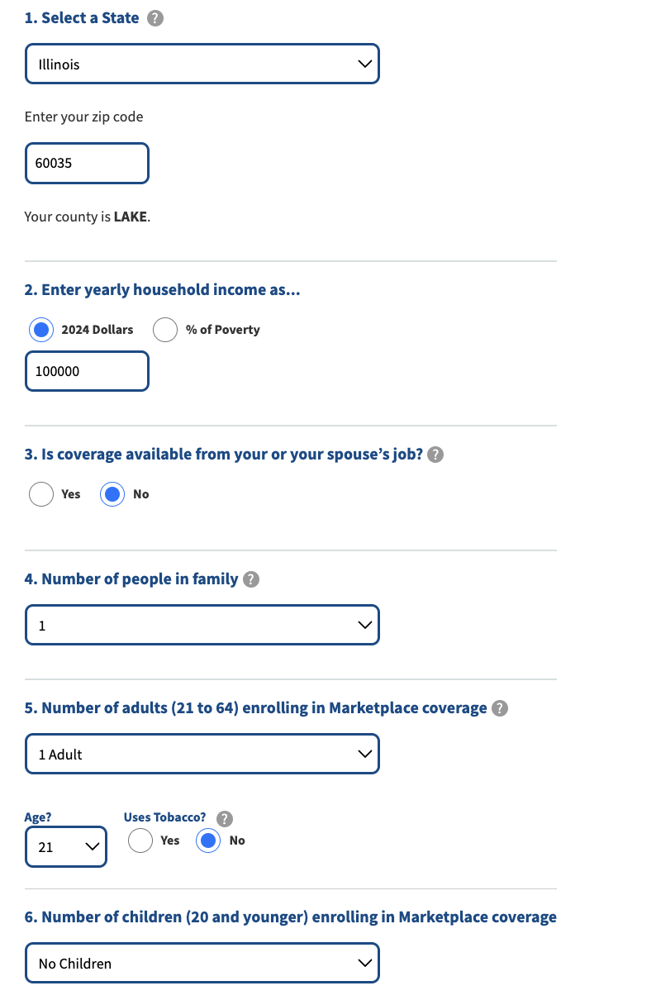

# Loops! 

Now that we know how to set up the page how we want it and scrape the text that we're interested in we need to think through how to loop through each of the different combinations of variables that we're interested in. This is where things get interesting! I like to think of it as a puzzle, and we need to figure out the right order and combination of how things fit together to get it to run. 

At this stage in the web scraping process, rather than diving straight into the code, we're going to focus on pseudo code to learn how to ** *think* ** about approaching the problem. Once you know what you want to do in the code, this is where our spooky friends ChatGPT/GitHub Co-Pilot really come in handy, particularly for producing complicated syntax (like turning a data frame into a nested dictionary) if you know the right questions to ask it. More on that later though. 

First, ry to break the problem down into which pieces we want to change at the same time, and which we want to stay consistent. As a reminder, the project team we're working with needs the cost of the Sliver Plan Premium for each county for people aged 14, 20, 40, and 60. 

### TASK 1 

**Looking at the web page, what values need to change *every* time we want to scrape a new value, and what values only need to be set *some* of the times we want to scrape the page?**

**ANSWER**

STATE only needs to change once we've gone through each of the: 
    ZIP CODE/COUNTY pairs in the state:
        AGE changes four times for each zip code/county

Now that we've thought through this heirarchy, we have the three levels of nexted for loops that we need!! 

### Functional Programming

Functional programming is ..... @Judah take it away 

We'll use functions to apply the code we wrote in Session 2 to our nested for loops. Functions are basically a way to generalize our code to say "At this point in the loop, take the values that we have (e.g., state = AL, zip code = 35004, age = 14) and set the values on the page. Then as those change in the next iteration of the loop, use the new values." 

## Nested Dictionaries

Now that we've figured out how to loop through all of the combinations of variables we need, and how to turn our web scraping code into functions, we need to figure out how to actually save the values we're scraping! 

[state: al{
    {county: st. clair 
        {zip code: 35004}}
    {county: }
]

### How to talk to ChatGPT 

