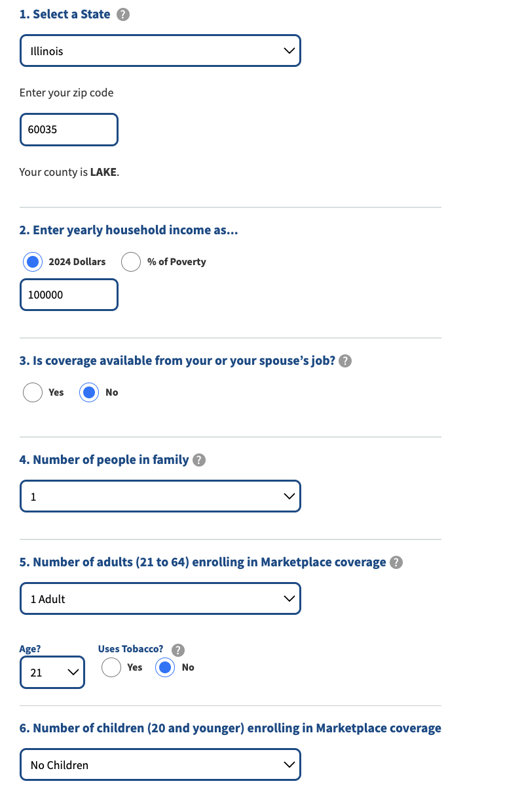

# Loops! 

Now that we know how to set up the page how we want it and scrape the text that we're interested in we need to think through how to loop through each of the different combinations of variables that we're interested in. This is where things get interesting! I like to think of it as a puzzle, and we need to figure out the right order and combination of how things fit together to get it to run. 

At this stage in the web scraping process, rather than diving straight into the code, we're going to focus on pseudo code to learn how to ** *think* ** about approaching the problem. Once you know what you want to do in the code, this is where Google/StackOverflow/GitHub co-pilot can come in handy if you know the right questions to ask. 

First, try to break the problem down into which pieces we want to change at the same time, and which we want to stay consistent. As a reminder, the project team we're working with needs the cost of the Sliver Plan Premium for each county for people aged 14, 20, 40, and 60. 

### TASK 1 

**Looking at the web page, what values need to change *every* time we want to scrape a new value, and what values only need to be set *some* of the times we want to scrape the page?**





**ANSWER**

STATE only needs to change once we've gone through each of the: 
&emsp;ZIP CODE/COUNTY pairs in the state:
&emsp;&emsp;&emsp;AGE changes four times for each zip code/county

Now that we've thought through this heirarchy, we have the three levels of nested `for` loops that we need!! 


### Functional Programming

Functional programming is ..... @Judah take it away 

We'll use functions to apply the code we wrote in Session 2 to our nested for loops. Functions are basically a way to generalize our code to say "At this point in the loop, take the values that we have (e.g., state = AL, zip code = 35004, age = 14) and set the values on the page. Then as those change in the next iteration of the loop, use the new values." 


### TASK 2

**Write pseudo code for a function that sets the ... What imputs would it need to take? What should it return**

```python
def setup_page(state, county, driver, zipcode):
    '''
     This functions sets up the initial page conditions that don't need to change with each iteration through the age groups 

     Inputs: 
        zipcode and county are inputs to the dropdown menus on the website. 
            Each time this function is called below, it is for a different cut of the data.
        counter (int): Counts how many times this function has been called in the script below
        driver: Specify the driver with the web page we are navigating 

    Returns: 
        Nothing, just sets up the page
     '''
	# function to set state, county, and income which don't change when looping through a county
    # pring the state and zip code to the console 
    print(f'State = {state}, zip Code ={zipcode}')
    
     # Select state dropdown
    select_dropdown(identifier='//*[@id="state-dd"]',driver = driver, value=state)
    # Enter zip code
    enter_text(identifier='//*[@id="zip-wrapper"]/div/input', driver = driver, text = zipcode)
        # if there's an option to select a county, select the county associated with the zip code
        # Attempt to locate and click the dropdown element

        # Enter yearly household income
    if is_textbox_empty(driver=driver, textbox_id='//*[@id="subsidy-form"]/div[2]/div[1]/div[2]/div[2]/input'):
        # enter income value if the text box does not already have text 
        enter_text(identifier='//*[@id="subsidy-form"]/div[2]/div[1]/div[2]/div[2]/input', driver = driver, text = '100000') # this stays the same each time
    
    # Is coverage available from your or your spouse's job? 
    click_button(identifier='//*[@id="employer-coverage-0"]', driver = driver,) # this stays the same each time
    
```

### TASK 3

```python
def scrape_data(age, driver):
     '''
     This functions scrapes the price of the silver plan premium (without financial help) for non-smoking 14, 17, 20, 40, and 60 year old people for each county nationally and saves it as a dataframe 

     Inputs: 
        age: an input to the dropdown menus on the website. 
            Each time this function is called below, it is for a different cut of the data.
        driver: Specify the driver with the web page we are navigating 

    Returns: 
        The Silver Plan Premium for the specified age
     '''
     # print the age that we are scraping to the console
     print(f'age = {age}')

     next_county = False

        # Number of adults (21 to 64) enrolled in Marketplace coverage? (changes based on input age)
     if age in [19, 39]: # these are the indexes for 40yo and 60yo
        # set number of kids to 0
        select_dropdown(identifier='//*[@id="subsidy-form"]/div[2]/div[3]/div[3]/div/select',driver = driver, index = '0')
        # set number of adults to 1
        select_dropdown(identifier='//*[@id="subsidy-form"]/div[2]/div[3]/div[1]/div/select',driver = driver, value = "1")
        # Age? (index is age minus 21)
        select_dropdown(identifier='//*[@id="subsidy-form"]/div[2]/div[3]/div[2]/div/div[1]/select', driver = driver,index = age)
     else: 
        # set number of adults to 0
        select_dropdown(identifier='//*[@id="subsidy-form"]/div[2]/div[3]/div[1]/div/select',driver = driver, value = "0")
        # Number of children (20 and younger) enrolling in Marketplace coverage
        select_dropdown(identifier='//*[@id="subsidy-form"]/div[2]/div[3]/div[3]/div/select',driver = driver, index = '1')
        select_dropdown(identifier='//*[@id="subsidy-form"]/div[2]/div[3]/div[4]/div/div[1]/select',driver = driver, index = age)
        
     # print update to console    
     print('Found data download button now clicking it')
     # Submit
     click_button(identifier='//*[@id="subsidy-form"]/p/input[2]', driver = driver,)

     time.sleep(1)       
     print('Now scraping data')

     ##--- Beautiful Soup ---###
     # Beautiful Soup setup using the desired URL
     html = driver.page_source
     soup = BeautifulSoup(html, 'html.parser')  # we use the 'lxml' parser here to scrape this page, which is very fast
     
     premium_val = str(soup.find_all('span', class_ = "bold-blue")[4])# select the 4th element which has the value we want 

     
     extracted_number = re.search(r'\$([\d,]+(?:\.\d{1,2})?)', premium_val)
     
    # Extract the matched group (number with $ and commas)
     matched_string = extracted_number.group(0)
    # Remove $ and commas from the matched string
     clean_number = matched_string.replace('$', '').replace(',', '')
    # Convert the cleaned string to a numeric value (float or int)
     number = float(clean_number) 
     print(number)
        
     return (number)

```
## Nested Dictionaries

Now that we've figured out how to loop through all of the combinations of variables we need, and how to turn our web scraping code into functions, we need to figure out how to actually save the values we're scraping! @judah take it away...

This code turns a dataframe of states, counties, and zip codes (with only one zip code per county) into a nested dictionary that we'll use in our for loops. The structure is that `state` is the top-level key, and then each county/zip pair are nested key-values like this: 

`[state: al{
    {county: st. clair 
        {zip code: 35004}}
    {county: }
}]`

This format is useful for us because we can specify the state that we're on, and then get both the county and zip code values together. 

```python
# Read in csv of states, counties, and zip codes (one zip per county)
 # Assuming you have a CSV file with columns 'State' and 'ZIP Code'
csv_file_path = 'data/state_zip_counties.csv'

# read in csv
raw_csv = pd.read_csv(csv_file_path, dtype={'zipcode': str})

# Create a nested dictionary
state_counties_zipcodes = {}

for index, row in raw_csv.iterrows():
    state = row['state_abbr']
    county = row['county']
    zipcode = row['zipcode']

    if state not in state_counties_zipcodes:
        state_counties_zipcodes[state] = {}

    state_counties_zipcodes[state][county] = zipcode
```

### TASK 4 - Putting it all together

Now that we have functions to 1) set up sections of the page that need to update for every county, and 2) set up what needs to change for different ages and scrape the value, we can put all of the pieces together. As a reminder, at a high-level, we want to initialize a driver, set up a dictionary to capture the values we scrape and specify the ages and state/counties we want to loop over,

1) Initialize a web driver
2) Initialize and empty dictionary to capture the values that we want to scrape 
3) Specify the ages and state/counties that we want to loop over
4) Loop over each state


```python
def run_entire_loop(counter):

    # Launch driver
    url = "https://www.kff.org/interactive/subsidy-calculator/"
    service = Service(executable_path=ChromeDriverManager().install())
    driver = webdriver.Chrome(service=service)
    driver.get(url)
    
    # initialize empty dictionary to capture the scraped values
    premium_val_dict = {} 
    # indexes for 14, 20, 40, and 60 years
    age_values = [14, 20, 19, 39] 
 
    # for each state and county combo in the state nested dict
    for state, counties in state_counties_zipcodes.items():
    # set the state as the top key in the output dictionary
        state_dict = premium_val_dict.setdefault(state, {})
    # loop through county, zip pairs
        for county, zip_code in counties.items():
        # initialize empty list to store premium plan values for 
        # the county that we're on in the loop 
            premium_val_list = []

            counter += 1

            print(counter)
            
            # call the setup_page function to set top dropdown values on page
            setup_page(state=state, driver = driver, county = county, zipcode=zip_code)
            
            # loop through ages we want to get premium values for
            for age in age_values:

                # call the scrape_data function to get the premium value 
                number = scrape_data(age = age, driver = driver)

                # for each zipcode, create a list of all of the premium plan costs for each age
                # this will be saved with the zipcode key in the dictionary
                premium_val_list.append(number)
                  
            # at the end of looping through all ages in the zip code add premium values to dictionary
            # note that this step is outside of the age for loop 
            state_dict[county] = premium_val_list

    return(counter, output_filename)
```

